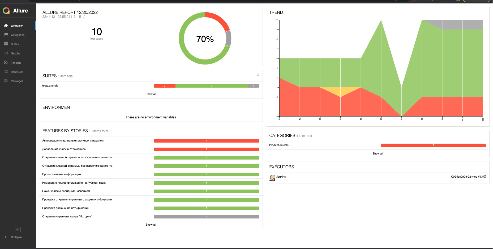
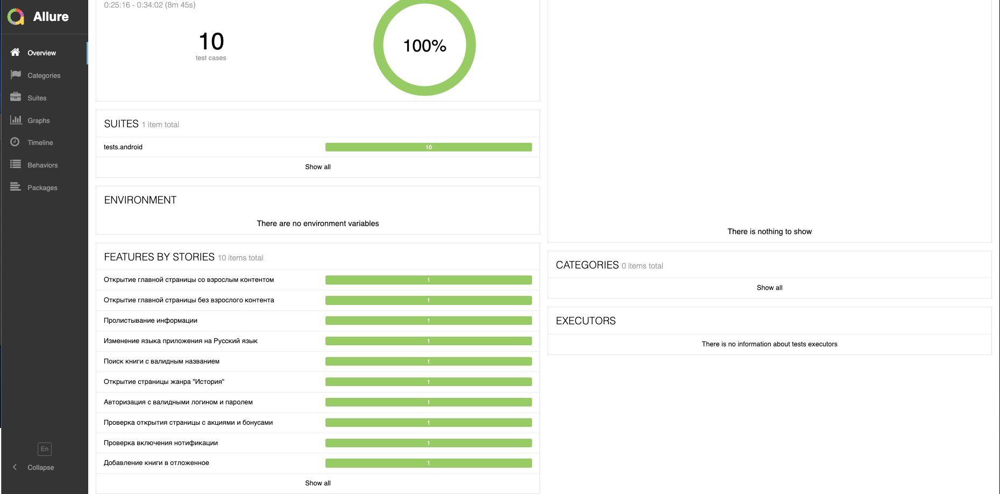
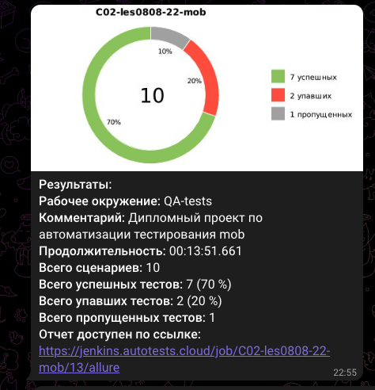

# Дипломный проект по автоматизации тестирования мобильного приложения LitRes

  

## Содержание:
- [Реализованные проверки по тест-кейсам](https://github.com/Elena0808/diplom_mobile#%D1%80%D0%B5%D0%B0%D0%BB%D0%B8%D0%B7%D0%BE%D0%B2%D0%B0%D0%BD%D0%BD%D1%8B%D0%B5-%D0%BF%D1%80%D0%BE%D0%B2%D0%B5%D1%80%D0%BA%D0%B8-%D0%BF%D0%BE-%D1%82%D0%B5%D1%81%D1%82-%D0%BA%D0%B5%D0%B9%D1%81%D0%B0%D0%BC)
- [Используемый стек](https://github.com/Elena0808/diplom_mobile#%D0%B8%D1%81%D0%BF%D0%BE%D0%BB%D1%8C%D0%B7%D1%83%D0%B5%D0%BC%D1%8B%D0%B9-%D1%81%D1%82%D0%B5%D0%BA)
- [Сборка в Jenkins](https://github.com/Elena0808/diplom_mobile#%D1%81%D0%B1%D0%BE%D1%80%D0%BA%D0%B0-%D0%B2-jenkins)
- [Allure report](https://github.com/Elena0808/diplom_mobile#allure-report)

## Реализованные проверки по тест-кейсам  
✓ Проверка открытия главной страницы приложения c разрешением отображать взрослый контент  
✓ Открытие главной страницы без включения взрослого контента  
✓ Скролл информации о приложении  
✓ Авторизация в приложении с валидными данными  
✓ Изменение языка приложения  
✓ Поиск книги с валидным наименованием  
✓ Открытие страницы жанра "История"  
✓ Открытие страницы с акциями и бонусами  
✓ Включение оповещений  
✓ Добавление книги в отложенное

## Используемый стек

<code></code>
<code></code>
<code></code>
<code></code>
<code></code>
<code></code>
<code></code>
<code></code>
<code></code>
<code></code>

## Сборка в Jenkins
[Ссылка на Jenkins](https://jenkins.autotests.cloud/job/C02-les0808-22-mob/)

## Allure report
[Ссылка на отчет](https://jenkins.autotests.cloud/job/C02-les0808-22-mob/13/allure/)

  

  

Пример оповещения в телеграмм

  

